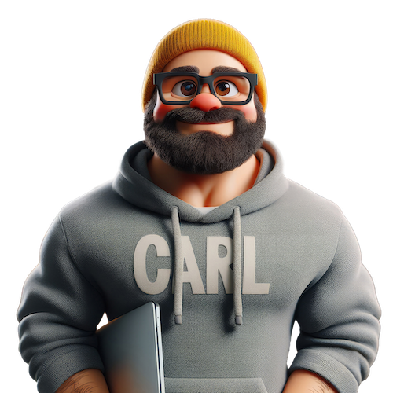

# About Us

## Brandon

Brandon is a musician, designer, photographer, amateur chef, as well as software engineer for Microsoft. Brandon is one of the many hands behind the scenes at the national-level [That Conference](https://thatconference.com/). In addition to being the social media guru there, he has been their chief photographer and often finds a topic to present on as well -- no matter which location he's at. Brandon brings his vast history of building product, both for his direct employer or their customers, to every project. In addition to traditional development skills, Brandon also brings a world-class understanding of DevOps to the table. 

In his free time, you will find Brandon with friends and family, often around home cooked food, or bouncing down the trail. 

## Carl

Carl is cyclist, handyman, podcast enthusiast, gamer, maker, as well as also being a software engineer for Microsoft. Carl has spoken regionally and nationally on many tech topics including cloud, mobile, and IoT and has also had a very successfull software development podcast with -- MS Dev Show.  He comes from a background of both enterprise and ISV development, while additionally taking a detour into consulting, Carl has seen it all. He might be opinionated in the architectures and technologies that he implements, but he becomes very pragmatic when working with customers, after all they have different backgrounds and business requirements.

Away from the microphone, Carl has a myriad of hobbies and interests that keep him and his large family very busy. 

## CloudChat

Born in the ashes of prior podcasts on both sides, CloudChat was mainly created to keep the technical conversations going. In case you haven't heard, the two hosts have worked together many times. And as such, we sincerely hope that listening to CloudChat feels like dropping in on a conversation between two old friends that just so happens to be about technical topics you want to learn more about. 
